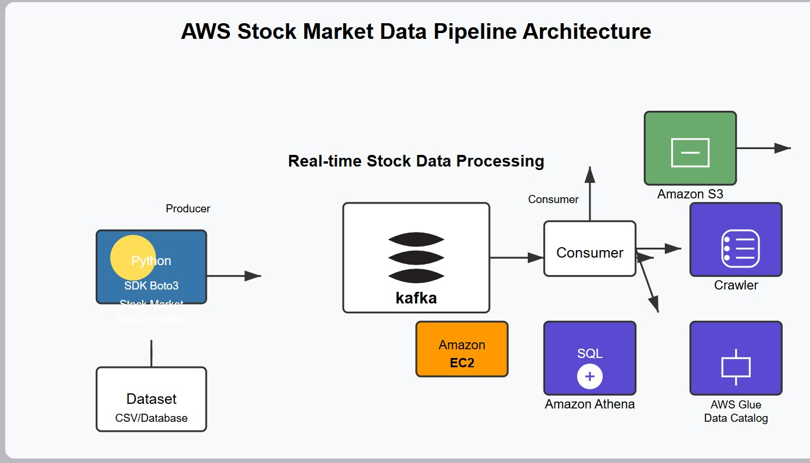

# 🧑‍💻 Stock Market Analysis using Kafka 🚀

This project demonstrates a **real-time stock market data pipeline** using **Apache Kafka**, **Python**, and **AWS services** such as **S3**, **Glue**, and **Athena**. 💹📈

---

## 🏗️ Architecture Overview



1. **Producer**: Simulates real-time stock price data using Python and pushes it to Kafka. 📊
2. **Kafka Broker (EC2)**: Handles stream data between Producer and Consumer. 🔄
3. **Consumer**: Receives data from Kafka and stores it into **Amazon S3**. ☁️
4. **AWS Glue Crawler**: Crawls S3 and updates the **Data Catalog**. 🧹
5. **Amazon Athena**: Enables SQL querying on S3-stored stock data for analysis. 🔍

---

## 📁 Project Structure
```
realtime-stock-analysis-kafka/
├── KafkaProducer.ipynb
├── kafkaConsumer.ipynb
├── .env
├── instruction.txt
├── architecture.png
└── .gitignore
```

## ⚙️ Setup & Usage

Refer to the [`instruction.txt`](./instruction.txt) file for detailed setup instructions and Run.

## 🛠️ Technologies Used

- Apache Kafka
- Python (with kafka-python library)
- AWS S3, Glue, Athena
- EC2 for Kafka Broker
  
## 📝 Note:
- Make sure you have Python 3.x installed and your AWS credentials properly configured before running the notebooks.
- Also, verify your Kafka broker is up and running on the specified EC2 instance for smooth data streaming.
- If you face any issues, check the logs carefully and consult the instruction.txt file for troubleshooting tips.
